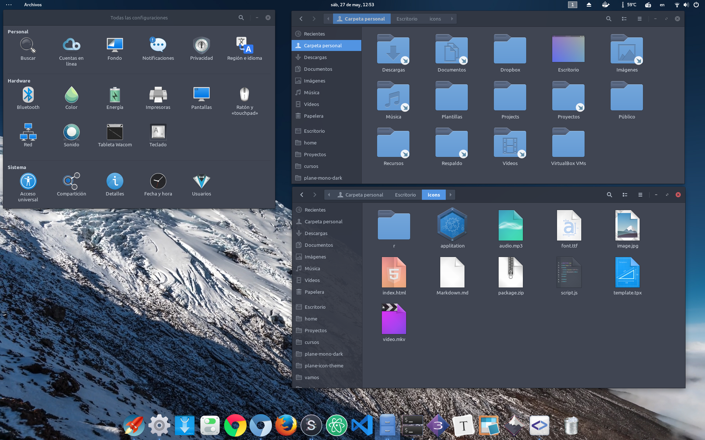

# Plane-icon-theme

A simple iconset, preferably used in dark versions of Gnome.  Love/Arch


- Source icons in = ./src/plane ./src/plane-dark

- Render icons in = ./plane ./plane-dark


## Build
- Is necesary nodejs 7.0 +
- `npm install`
- `npm start`
- `gulp`


## Installation

Downlad the lasted version in

```
$ gulp
$ sudo gulp copy
```

## Developer
``` 
$ sudo gulp link 
$ gulp watch #Auto update 

$ gulp watch -P #Auto update with refresh icon cache Light version
$ gulp watch -D #Auto update with refresh icon cache Dark version
```





License: GPLv3