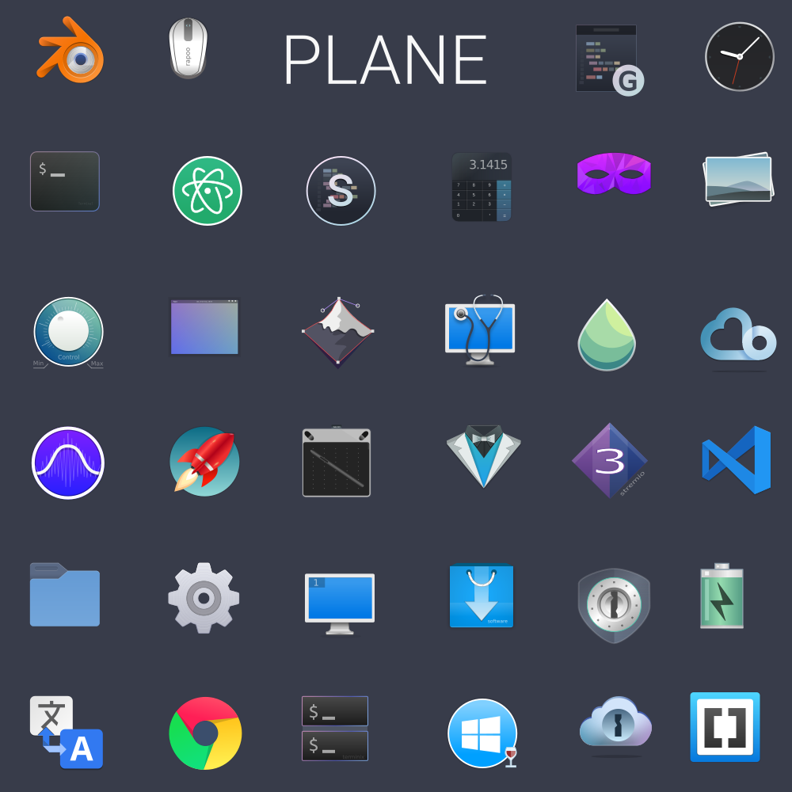

<p align="center">

</p>


# Plane icon theme

A simple iconset, preferably used in dark versions of Gnome.  Love/Arch/Inkscape/Gnome, more information in [Plane project](https://github.com/wfpaisa/plane)


- Source icons in = `./src/variants/plane`  and `./src/variants/*` are all posible variants

- Render icons in = `./build/variants/*` and zip in `./build/zip-variants/*`


## Installation

1. Downlad the lasted version in `./build/zip-variants/`
2. Unzip in `[USER_FOLDER]/.local/share/icons`
3. Change icon set with Gnome Tweak Tool


## Build
Here [videos](https://goo.gl/VG1t8R)

- Is necesary nodejs 7.0 +
- `$ npm install`
- `$ npm install --global gulp-cli`
- `$ gulp`


## Developer

The folder `./src/variants/*` contains all possible icon variants and the var `variants` in the `gulpfile.js` have an array with all posible icon set variants.

Allows hot editing, gulp watch auto will generate the icon and if you pass the parameter will update the icon set.

```bash 
# Build with debug
$ gulp -debug

# Auto update
# Change [-PlaneGnome] for the icon set you want reload from `./build/variants`
$ ln -s [FOLDER_PATH]/build/variants/PlaneGnome ~/.local/share/icons/PlaneGnome
$ gulp watch -PlaneGnome

```

#### ERRORs
- "Error: watch /xxx/xxx ENOSPC"  Solution -> `echo fs.inotify.max_user_watches=524288 | sudo tee -a /etc/sysctl.conf && sudo sysctl -p`  [more info](https://github.com/gulpjs/gulp/issues/217) 


### Estructure file
`./assets/templates/*` contain it the templates with the structure, all templates should have the this structure:

[tag] => inkscape layer
```
folder.svg
	[icon_16|desktop_scalable] -> Render: 16/folder.svg or scalable/desktop.svg 
		[icon]
			"icon content"
		[frame]"contain only a rectangle with sizes of the icon"
			[frame_16] "must be Rectangle, Render icon with this sizes"
```

- *.svg* properties are: units in `px`, the `scale in x="1.000"` `scale in y="1.000"`, `viewbox x:0, y:0`
- The script get all layers the first level and render them Individually


### Libreoffice icons

- Light `$ sudo cp ./build/libreoffice-breeze/images_breeze.zip /usr/lib/libreoffice/share/config/images_breeze.zip` Then open Libreoffice and go to Tools->Options->View and choose Breeze.
- Dark `$ sudo cp ./build/libreoffice-breeze/images_breeze_dark.zip /usr/lib/libreoffice/share/config/images_breeze_dark.zip` Then open Libreoffice and go to Tools->Options->View and choose Breeze_dark.



[see more screenshots](./screenshots.md)

## Thanks to

- (Breeze)[https://github.com/KDE/breeze-icons]
- (Arc Icon Theme)[https://github.com/fc8855/arc-icons]
- (Paper Icon Theme)[https://github.com/snwh/paper-icon-theme]

And all those designs that served as inspiration


## Reviews
- (desdelinux)[https://blog.desdelinux.net/plane-moderno-paquete-iconos-gnome/]
- (Charlie Henson)[https://www.youtube.com/watch?v=9s5H3sbNgAU&t=27s]

## Todo
- https://trello.com/b/m7BIbGZb/plane-icons

License: GPLv3